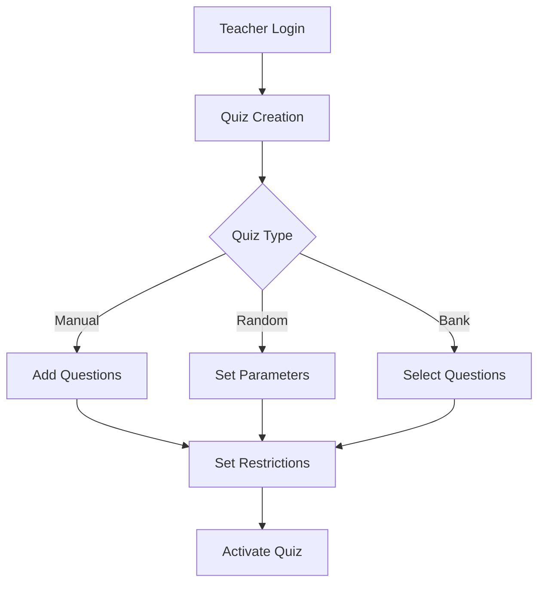
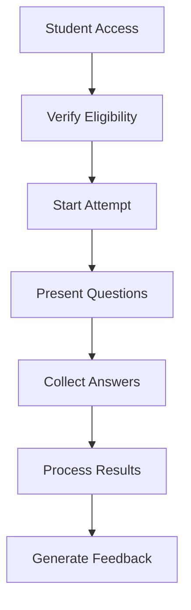

# Quiz4 System Documentation

## Table of Contents
- [System Overview](#system-overview)
- [Core Components](#core-components)
- [Business Logic](#business-logic)
- [Flow Control](#flow-control)
- [Security Model](#security-model)

## System Overview
Quiz4 is an educational assessment system that manages quizzes, question banks, and student evaluations. It provides flexible quiz creation, automated grading, and comprehensive analytics.

## Core Components

### 1. Quiz Management System
- **Quiz Types**
  - Regular Quiz (Fixed Questions)
  - Random Quiz (Dynamic Selection)
  - Bank Selection Quiz
  - Delayed Question Addition
  
- **Quiz Properties**
  - Time Limits
  - Attempt Restrictions
  - Scoring Systems
  - Display Modes (Horizontal/Vertical)

### 2. Question Bank System
- **Organization**
  - Subject-based Categorization
  - Unit/Lecture Association
  - Difficulty Levels
  - Active/Inactive States

- **Question Properties**
  - Text Content
  - Image Support
  - Multiple Choice Options
  - Point Values
  - Visibility Controls

### 3. Assessment Engine
- **Attempt Management**
  - Trial Tracking
  - Time Monitoring
  - Progress Saving
  - Result Recording

- **Grading System**
  - Automatic Scoring
  - Answer Validation
  - Mistake Tracking
  - Performance Analytics

## Business Logic

### 1. Quiz Creation Process
1. Teacher initiates quiz creation
2. Selects quiz type and parameters
3. Configures questions based on type:
   - Manual addition
   - Random selection
   - Bank selection
4. Sets restrictions and time limits
5. Activates quiz for student access

### 2. Question Management Flow
1. Question Creation/Import
2. Categorization and Tagging
3. Difficulty Assignment
4. Answer Configuration
5. Visibility Control
6. Bank Organization

### 3. Student Quiz Flow
1. Access Validation
2. Attempt Creation
3. Question Presentation
4. Answer Collection
5. Time Management
6. Result Processing
7. Feedback Generation

## Flow Control

### Quiz Creation Flow

### Student Assessment Flow

## Security Model

### Access Control
1. **Role-Based Permissions**
   - Teacher Rights
   - Student Access
   - Owner Privileges

2. **Content Protection**
   - Quiz Access Control
   - Time Limit Enforcement
   - Attempt Restrictions

3. **Data Integrity**
   - Transaction Management
   - Answer Validation
   - Result Protection

### Validation Layers
1. **Authentication**
   - Login Requirements
   - Session Management
   - Permission Checks

2. **Quiz Security**
   - Time Monitoring
   - Anti-Tampering Measures
   - Result Verification

3. **Data Security**
   - Input Sanitization
   - CSRF Protection
   - Error Handling

## System Integration

### Component Interaction
1. **Quiz-Bank Integration**
   - Question Selection
   - Bank Management
   - Content Synchronization

2. **Assessment-Result Flow**
   - Answer Processing
   - Score Calculation
   - Result Storage

3. **Analytics Integration**
   - Performance Tracking
   - Result Analysis
   - Report Generation

## Best Practices

### 1. Data Management
- Efficient Query Design
- Caching Strategies
- Transaction Handling

### 2. User Experience
- Clear Navigation
- Error Feedback
- Progress Tracking

### 3. System Maintenance
- Regular Backups
- Performance Monitoring
- Error Logging

## Error Handling

### 1. Quiz Errors
- Time Limit Violations
- Access Restrictions
- Submission Failures

### 2. Question Bank Errors
- Import Failures
- Content Validation
- Format Issues

### 3. System Errors
- Database Errors
- Permission Issues
- Integration Failures
1. Fork the repository
2. Create feature branch
3. Submit pull request
4. Follow coding standards

## License
MIT License - See LICENSE file for details
